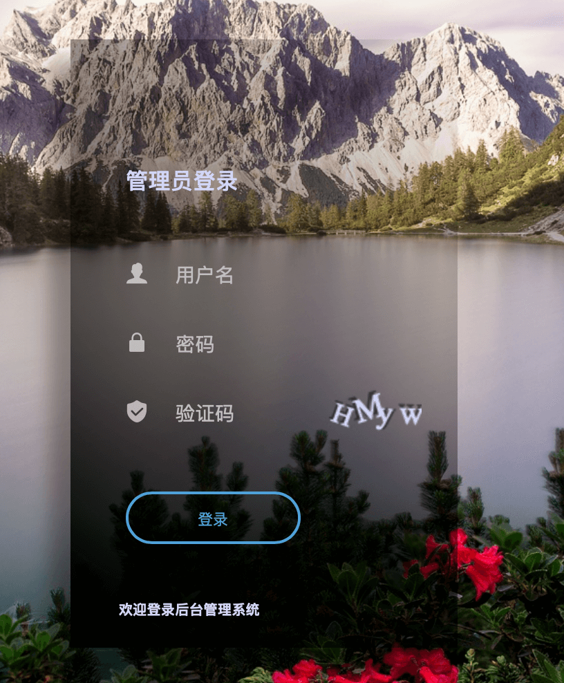
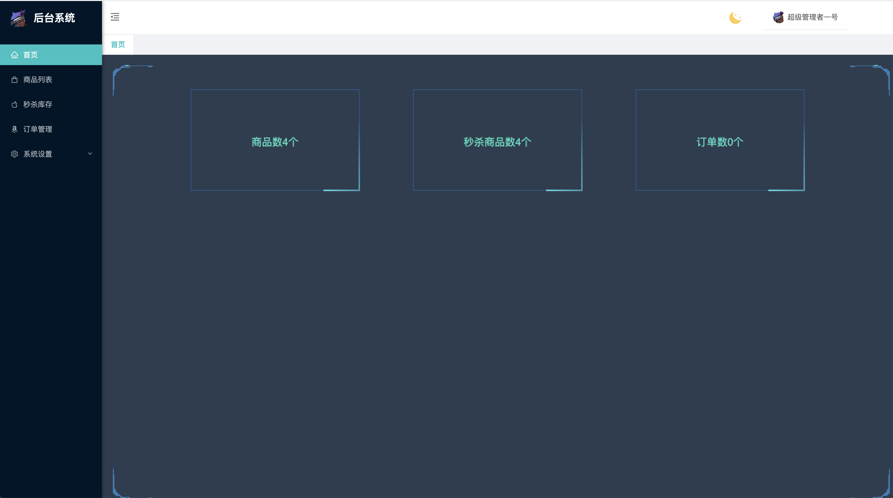
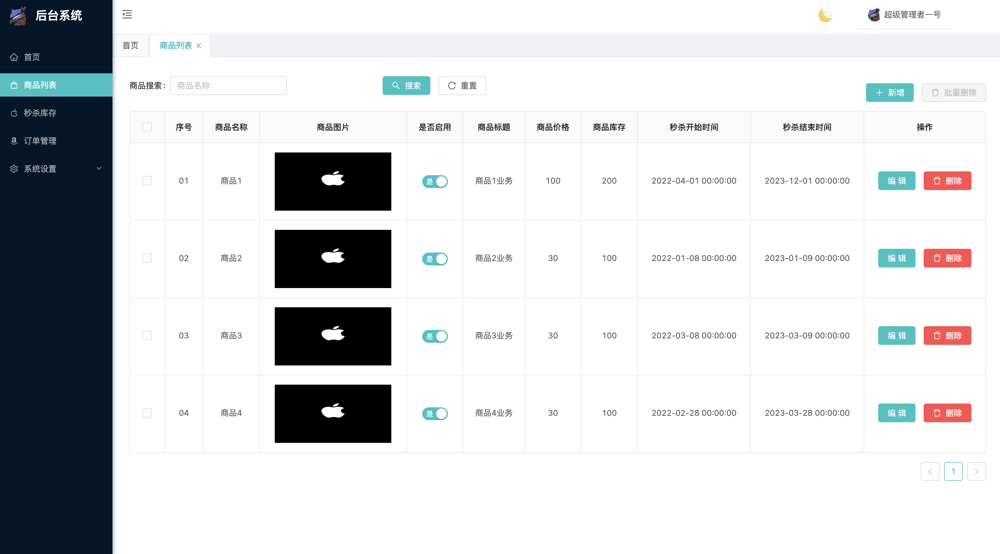
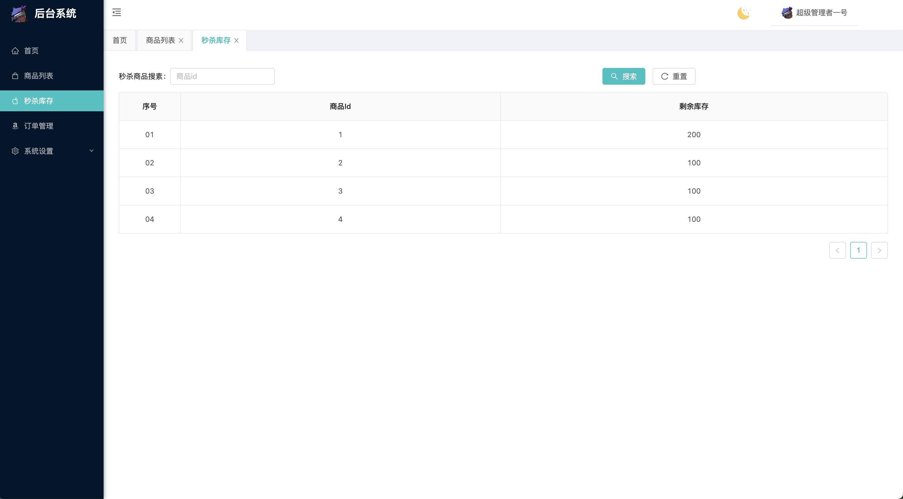
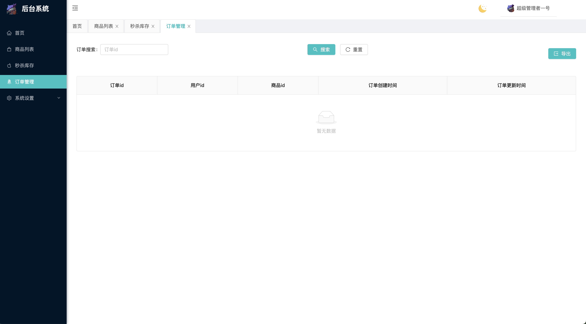
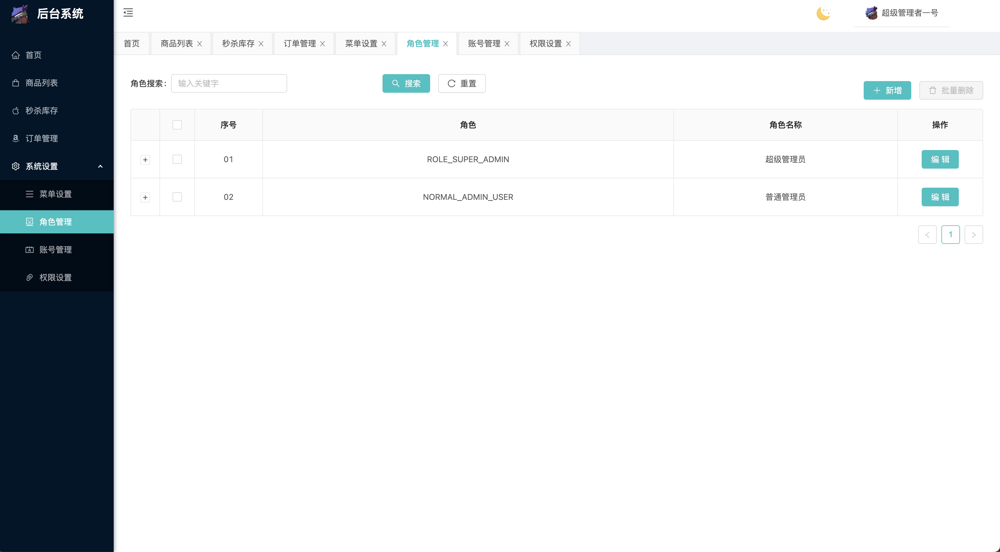
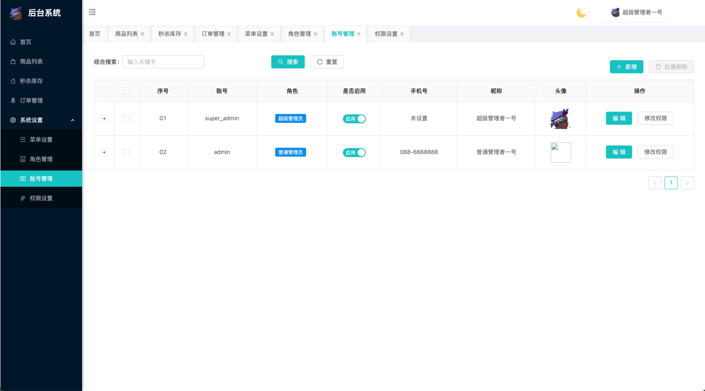

# 简介
针对前后端分离的需求，构建了以React以及相关开发脚手架开发的前端系统，负责与后端的商品秒杀控制和管理者权限系统服务器。

# 图文一览

- 登陆界面



- 首页




- 商品列表配置界面



- 商品秒杀库存界面




- 订单管理界面




- 菜单设置界面


- 角色管理界面




- 账号管理界面



- 权限管理界面


# 如何使用
## `项目准备`
由于此项目是前后端分离，请先把后端项目跑起来。
下载前端源码后
- npm install   或者 yarn install (建议yarn方式)
- node版本推荐为v12.0.0左右，版本过高会有不兼容问题
下载环境依赖包
## `本地部署`
1. 修改根目录下 .env 全局文件中的变量。变量PORT是控制启动端口，与package.json文件中的启动脚本语句结合使用，可改为3001，无妨使用。.env文件中的REACT_APP_BASE_URL变量是结合setupProxy.js文件中的目标网址使用，这一块代理请求的知识在[自己的总结](./THINK.md)里说。以及.env和setupProxy.js文件改了内容后都要重启才生效。
2. 终端输入```yarn start```

本地运行项目，一般会自动打开游览器直接访问。  

# 解决BUG
- 有时候启动时会报错babel-jest错误，看具体报错内容，去lock文件中删除与项目制定babel-jest版本不符的依赖，再删除node_modules包，再yarn install 命令重新安装。

# 参考
[自己总结](./THINK.md)

参考网上部分代码：
- [react权限管理系统](https://gitee.com/Explore_Mr_Pei/admin_manager)

报错参考：
- [启动 code1 报错](https://www.jianshu.com/p/c06c4d38636e)
